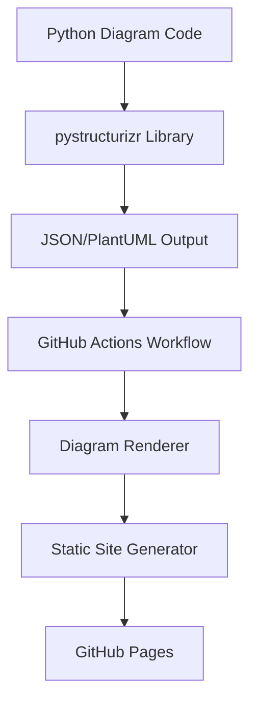

# Design Document

## Overview

This project creates a Python-based architectural documentation system using pystructurizr for diagram generation and GitHub Actions for automated publishing to GitHub Pages. The system uses uv for modern Python package management and provides a complete workflow from diagram definition to web publication.

The architecture follows a pipeline approach: Python code defines diagrams → GitHub Actions renders them → Static site displays results on GitHub Pages.

## Architecture

### High-Level Architecture



### Project Structure

```
project-root/
├── pyproject.toml              # uv configuration and dependencies
├── uv.lock                     # Dependency lock file
├── .github/
│   └── workflows/
│       └── render-diagrams.yml # GitHub Actions workflow
├── src/
│   └── diagrams/
│       ├── __init__.py
│       ├── example_system.py   # Sample diagram definitions
│       └── utils.py            # Diagram utilities
├── docs/                       # Generated documentation
│   ├── index.html             # Main page template
│   └── diagrams/              # Rendered diagram outputs
├── templates/                  # HTML templates for GitHub Pages
│   ├── base.html
│   └── diagram.html
└── README.md                   # Project documentation
```

## Components and Interfaces

### 1. Python Diagram Definitions (`src/diagrams/`)

**Purpose:** Define architectural diagrams using pystructurizr Python API

**Key Components:**
- `example_system.py`: Sample system demonstrating different view types
- `utils.py`: Helper functions for common diagram patterns
- Base classes for consistent diagram structure

**Interface:**
```python
class DiagramGenerator:
    def create_workspace(self) -> Workspace
    def add_system_context_view(self) -> SystemContextView
    def add_container_view(self) -> ContainerView
    def export_to_json(self) -> str
    def export_to_plantuml(self) -> str
```

### 2. GitHub Actions Workflow (`.github/workflows/render-diagrams.yml`)

**Purpose:** Automate diagram rendering and site deployment

**Key Steps:**
1. Checkout repository
2. Set up Python with uv
3. Install dependencies
4. Execute diagram generation scripts
5. Render diagrams to PNG/SVG using PlantUML
6. Generate static HTML pages
7. Deploy to GitHub Pages

**Triggers:**
- Push to main branch
- Manual workflow dispatch
- Pull request (for validation)

### 3. Static Site Generator

**Purpose:** Create navigable HTML interface for viewing diagrams

**Features:**
- Responsive design for different screen sizes
- Automatic navigation generation based on available diagrams
- Diagram metadata display (title, description, last updated)
- Search and filtering capabilities

### 4. Diagram Rendering Pipeline

**Purpose:** Convert pystructurizr output to visual formats

**Components:**
- PlantUML integration for PNG/SVG generation
- JSON processing for metadata extraction
- File organization and naming conventions
- Error handling and validation

## Data Models

### Workspace Configuration

```python
@dataclass
class DiagramConfig:
    name: str
    description: str
    version: str
    author: str
    output_formats: List[str]  # ['png', 'svg', 'plantuml']
```

### Diagram Metadata

```python
@dataclass
class DiagramMetadata:
    title: str
    description: str
    diagram_type: str  # 'system_context', 'container', 'component'
    last_updated: datetime
    file_path: str
    output_files: Dict[str, str]  # format -> file_path
```

### Site Configuration

```python
@dataclass
class SiteConfig:
    title: str
    description: str
    base_url: str
    theme: str
    navigation: List[Dict[str, str]]
```

## Error Handling

### Python Diagram Generation
- Validate diagram definitions before rendering
- Provide clear error messages for invalid configurations
- Handle missing dependencies gracefully
- Log detailed information for debugging

### GitHub Actions Workflow
- Fail fast on critical errors (missing dependencies, invalid Python code)
- Continue on non-critical errors (individual diagram failures)
- Provide detailed logs for troubleshooting
- Send notifications on workflow failures

### Static Site Generation
- Handle missing diagram files gracefully
- Provide fallback content for failed renders
- Validate HTML output before deployment
- Implement proper error pages (404, 500)

## Testing Strategy

### Unit Tests
- Test individual diagram generation functions
- Validate JSON/PlantUML output format
- Test utility functions and helper classes
- Mock external dependencies (PlantUML service)

### Integration Tests
- Test complete diagram generation pipeline
- Validate GitHub Actions workflow in test environment
- Test static site generation with sample data
- Verify GitHub Pages deployment process

### End-to-End Tests
- Test complete workflow from code change to published site
- Validate diagram rendering quality and accuracy
- Test site navigation and user experience
- Performance testing for large diagram sets

### Validation Tests
- Validate pyproject.toml configuration
- Test uv dependency management
- Verify GitHub Actions workflow syntax
- Check HTML template validity

## Implementation Considerations

### Performance Optimization
- Cache PlantUML renders to avoid regenerating unchanged diagrams
- Optimize image sizes for web display
- Implement lazy loading for large diagram collections
- Use GitHub Actions caching for dependencies

### Security
- Validate user input in diagram definitions
- Sanitize HTML output
- Use secure GitHub Actions practices
- Implement proper access controls for GitHub Pages

### Maintainability
- Use consistent coding standards and linting
- Implement comprehensive documentation
- Provide clear examples and templates
- Use semantic versioning for releases

### Scalability
- Support multiple diagram files and directories
- Handle large numbers of diagrams efficiently
- Implement parallel processing where possible
- Design for easy extension with new diagram types